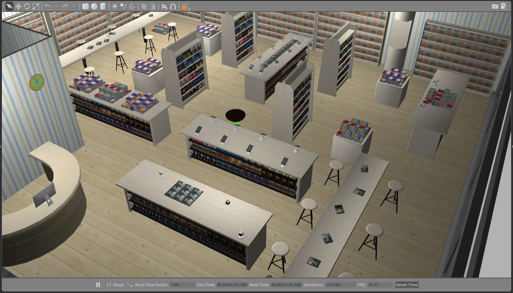

# AWS RoboMaker Bookstore World ROS package



**Visit the [RoboMaker website](https://aws.amazon.com/robomaker/) to learn more about building intelligent robotic applications with Amazon Web Services.**

# Include the world from another package

* Update .rosinstall to clone this repository and run `rosws update`
```
- git: {local-name: src/aws-robomaker-bookstore-world, uri: 'https://github.com/aws-robotics/aws-robomaker-bookstore-world.git', version: master}
```
* Add the following to your launch file:
```python
launch.actions.IncludeLaunchDescription(
    launch.launch_description_sources.PythonLaunchDescriptionSource(
        [get_package_share_directory(
            'aws_robomaker_bookstore_world'), '/launch/bookstore.launch.py']
    )
)
```

# Load directly into Gazebo (without ROS)
```bash
export GAZEBO_MODEL_PATH=`pwd`/models
gazebo worlds/bookstore.world
```

# ROS Launch with Gazebo viewer (without a robot)
```bash
# build for ROS
rosdep update
rosdep install --from-paths . --ignore-src -r -y
colcon build

# run in ROS
source install/setup.sh
ros2 launch aws_robomaker_bookstore_world bookstore.launch.py gui:=true
```

# Building
Include this as a .rosinstall dependency in your SampleApplication simulation workspace. `colcon build` will build this repository.

To build it outside an application, note there is no robot workspace. It is a simulation workspace only.

```bash
rosdep install --from-paths . --ignore-src -r -y
colcon build
```

# Robot Simulation - Initial Position
A reasonable initial position would be near the service desk at (0.5,1.0,0.0).
