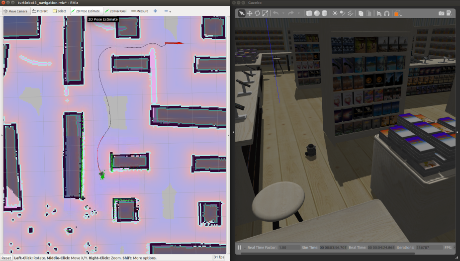

# AWS RoboMaker Bookstore World ROS package

**This is a pre-release. Do not consume.**


# Include the world from another package

* Update .rosinstall to clone this repository and run `rosws update`
```
- git: {local-name: src/aws-robomaker-bookstore-world, uri: 'https://github.com/aws-robotics/aws-robomaker-bookstore-world.git', version: master}
```
* Add the following to your launch file:
```xml
<launch>
  <!-- Launch World -->
  <include file="$(find aws_robomaker_bookstore_world)/launch/bookstore.launch"/>
  ...
</launch>
```

# Load directly into Gazebo (without ROS)
```bash
export GAZEBO_MODEL_PATH=`pwd`/models
gazebo worlds/bookstore.world
```

# ROS Launch with Gazebo viewer (without a robot)
```bash
# build for ROS
rosdep install --from-paths . --ignore-src -r -y
colcon build

# run in ROS
source install/setup.sh
roslaunch aws_robomaker_bookstore_world bookstore.world
```

# Robot simulation
With Turtlebot Burger initially positioned near the service desk: 
```
export TURTLEBOT3_MODEL=waffle_pi
export ROBOT_INITIAL_POSE="-x 0.5 -y 1.0 -z 0.0 -R 0.0 -P 0.0 -Y 0.0"
roslaunch turtlebot_gazebo turtlebot_world.launch  world_file:=`pwd`/worlds/bookstore.world
```

# Navigation
A SLAM-generated map for *Turtlebot Waffle PI* is included.

Run:
```bash
roslaunch aws_robomaker_bookstore_world bookstore_turtlebot_navigation.launch 
```

Run with rviz:
```bash
roslaunch aws_robomaker_bookstore_world bookstore_turtlebot_navigation.launch open_rviz:=true
```

Run RViz separately:
```
rviz -d rviz/turtlebot3_navigation.rviz
```


